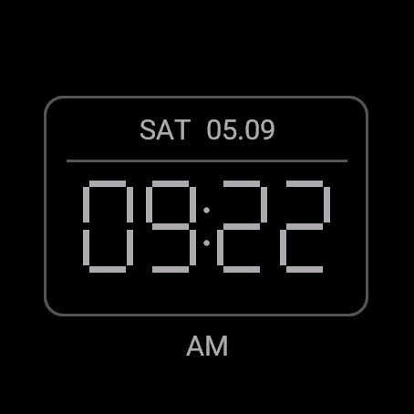

# Garmin watch feedback — 2026-09-05

Scope: Garmin presentation/input handling only, on branch
`codex/garmin-watch-feedback` based on `afaae9cf66135c7868dd6ea8451f2969203e42b5`.
Provider adapters, protocols, GPS policy, companion configuration, and the
2.5-second activation threshold are unchanged.

## Automated gates

- `make ci`: PASS, 133 Python tests, 8 recipient tests, 4 mailbox tests, plus
  syntax/schema checks. Existing Python HTTPError cleanup warnings remain.
- Connect IQ SDK **9.2.0**, macOS, Android Studio bundled JDK, `-l 1`:
  fēnix 8 47 mm production beta test build PASS.
- fēnix 8 47 mm and Venu X1 structured simulator suites, each:
  `PASSED (passed=13, failed=0, errors=0)`. The runner's process exit code is 1
  even with this passing structured result.
- Production `beta.jungle` export at `-l 1`: **17 OUT OF 17 DEVICES BUILT**,
  `BUILD SUCCESSFUL`. Local artifact: `apps/garmin/bin/OpenDistress-watch-feedback.iq`.
  No version tag or public release was created. Strict `-l 3` was not claimed.
- New runtime cases exercise cancelled/complete/hidden holds, no alert from
  navigation, geometry/pulse bounds, coordinate-bearing touch dispatch,
  preserving the clock when the triggering key is released after acceptance,
  and the absence of an accidental reset from clock/outside-target taps.
- The completed-hold test advances the probe's timestamp and substitutes
  `activate()`. It is a state-machine test, not physical timing or delivery proof.

## Computer-use observations

All visual interaction checks use `apps/garmin/simulator/preview.jungle`, a
separate application ID and synthetic acceptance with network/location entry
points disabled. No real provider alert was sent.

| Profile / check | Observed result |
| --- | --- |
| fēnix 8 47 mm / Ready | START indicator beside upper-right key; short mouse press returned to Ready without activating the fixture. |
| fēnix / fixture states | UP cycled partial-hold ring, sending, then clean digital clock. Partial hold is a synthetic visual state. |
| fēnix / accepted navigation | Lower-left DOWN opened status; START returned to clock without resetting. |
| fēnix / text | Separate delivery-evidence line fixed the observed ellipsis that had hidden the delivery disclaimer. |
| Venu X1 / clock and status | Clock tap opened status; rectangular right-edge key marker and explicit touch reset were visible, with no fictitious MENU key. |
| Venu X1 / touch reset before fix | FAILED: the behaviour-level select handler consumed the tap before its coordinates reached the reset handler. |
| Venu X1 / touch reset after fix | Manual retest pending: the Mac locked before computer use could resume. Runtime coordinate-routing regression is included above. |
| fēnix / input routing after final select-handler fix | Manual retest pending; earlier navigation observations predate this dispatch change. |
| Instinct 3 Solar 45 mm / compact layout | Preview compiled; visual inspection NOT_RUN. |
| Physical hold, haptic quietness, outdoor/indoor GPS, recipient delivery | NOT_RUN; not established by this visual fixture or these tests. |

The saved fēnix screenshot is a real simulator capture of the offline accepted
fixture, not hardware or provider evidence:

## Design and platform constraints

- Original seven-segment clock, true local time/date, native 12/24-hour choice.
  No copied watch-face assets or fake battery/sensor/notification indicators.
- Per-family physical-key resources project the installed SDK simulator's key
  centres into screen-relative indicators. Venu X1 uses right-edge strokes.
- Press/hold feedback is local interaction evidence only. The quiet clock still
  requires persisted direct-provider acceptance; it does not mean delivery or
  rescue. No permanent alert overlay or continuous animation on the clock.
- [Garmin System.exitTo](https://developer.garmin.com/connect-iq/api-docs/Toybox/System.html#exitTo-instance_function)
  supports launching device apps, native activities and widgets, not installed
  watch faces; it exits the current app. Our own foreground clock keeps the
  existing location path available.
- [Garmin BehaviorDelegate](https://developer.garmin.com/connect-iq/api-docs/Toybox/WatchUi/BehaviorDelegate.html)
  consumes the corresponding raw input when its handler returns true. Select
  now falls through so `onTap` retains reset-target coordinates; hardware
  selection is handled separately and guarded against the triggering release.

No Garmin Store submission, release publication, or Garmin UI branch merge was
performed for this change. README PR #20 was merged separately at the base SHA.
